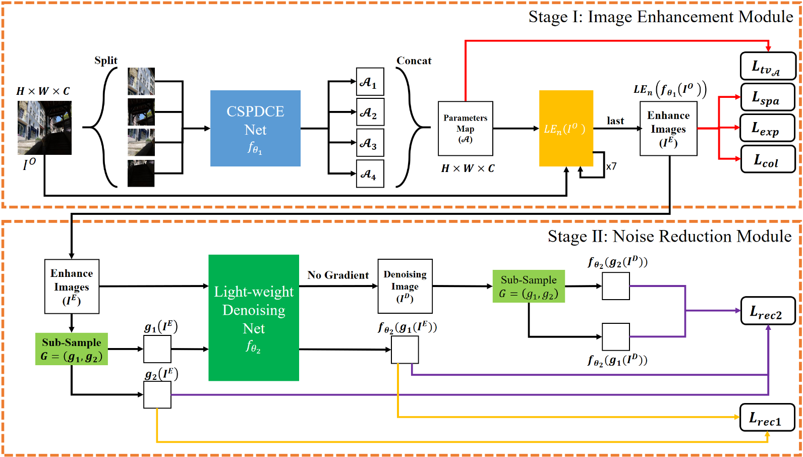

# 基於自監督學習之零參考樣本的低光影像增強與雜訊抑制之研究   A-Study-on-Zero-Reference-Image-Enhancement-with-Noise-Reduction-Based-on-Self-Supervised-Learning

# 簡介
本專案利用self supervised learning的方式建構了一種無需正常光影像作為參考的低光影像增強系統，系統由Image Enhancement Module 與 Noise Reduction Module組成

