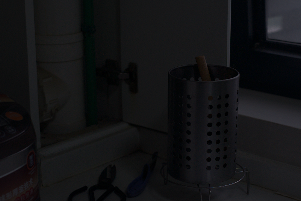
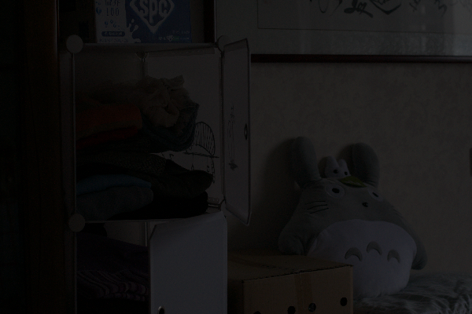

# 基於自監督學習之零參考樣本的低光影像增強與雜訊抑制之研究   A-Study-on-Zero-Reference-Image-Enhancement-with-Noise-Reduction-Based-on-Self-Supervised-Learning

# 簡介
本專案利用self supervised learning的方式建構了一種無需正常光影像作為參考的低光影像增強系統，系統由Image Enhancement Module 與 Noise Reduction Module組成

# 網路架構

# 實驗結果圖
LOL Dataset : https://daooshee.github.io/BMVC2018website/
| 增強前 | 增強後 |
| :----: | :----: |
|  |  |
|  |  |
|  |  |
|  |  |

測試低光影像增強系統對人臉偵測([RetinaFace](https://github.com/peteryuX/retinaface-tf2))的影響
| 增強前 | 增強後 |
| :----: | :----: |
|  |  |
|  |  |
|  |  |
|  |  |
|  |  |
|  |  |

# 實驗結果
| Method | SSIM |	PSNR(dB) | Parameter(M) | Speed/ms |
| :----: | :--: |	:------: | :----------: | :------: |
| Input  |	0.195 |	7.77 | - |	- |
| HE     |0.496	| 14.10	| -	| 6.28 |
| LIME   | 0.514 | 14.22 | - | 2466 |
| RetinexNet | 0.419 | 16.77 | 0.55 | 216 |
| EnlightenGAN | 0.651 | 17.48 | 8.64 | 385 |
| Zero-DCE | 0.532 | 16.88 | 0.07 | 48 |
| Proposed | 0.734 | 17.58 | 0.34 | 95 |

# 論文
撰寫中...
